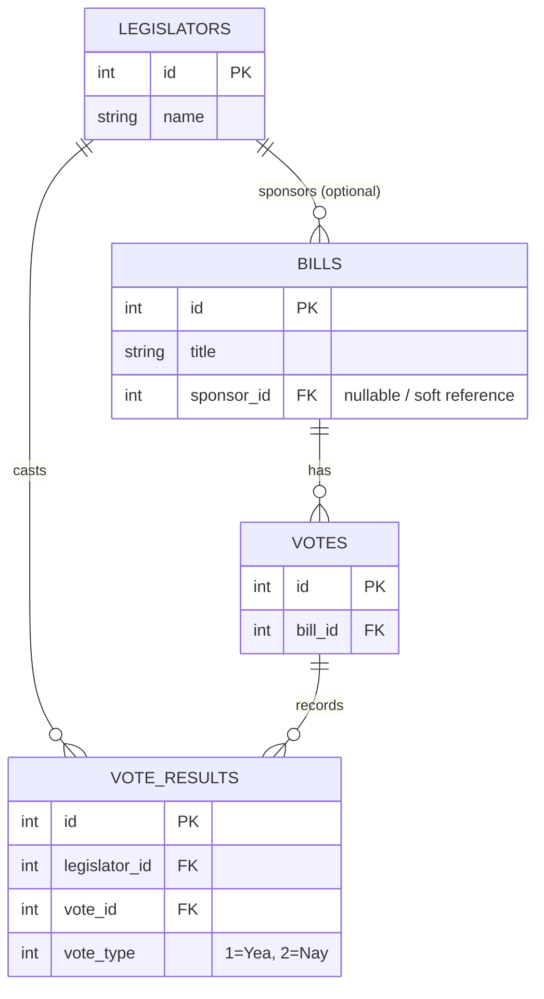
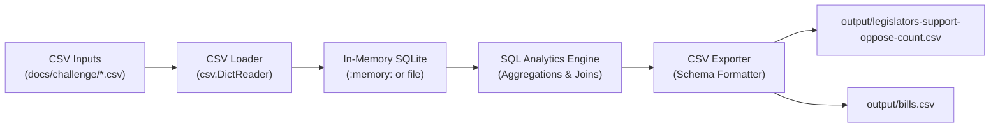

# Quorum Coding Challenge - Legislative Data Analysis

A robust, zero-dependency Python solution for analyzing legislative voting data from the United States Congress.

---

## Overview

At Quorum, legislative data represents legislators, bills introduced in Congress, votes on those bills, and individual vote results cast by legislators. This application processes these datasets to answer two key questions:

1. **Legislator Support / Oppose Summary** (`output/legislators-support-oppose-count.csv`):
   - For every legislator in the dataset, how many bills did they support (voted Yea, `1`)?
   - How many bills did they oppose (voted Nay, `2`)?
2. **Bill Support / Oppose Summary** (`output/bills.csv`):
   - For every bill in the dataset, how many legislators supported the bill?
   - How many legislators opposed the bill?
   - Who was the primary sponsor of the bill (falling back to `"Unknown"` if unlisted)?

---

## Architectural Design

The solution leverages Python's built-in `sqlite3` relational engine to ingest CSV records, enforce relational schemas and constraints, and execute analytical aggregations with indexing.

### Relational Entity-Relationship Diagram



### Pipeline Flow



### Key Technical Highlights
- **Zero Production Dependencies**: Uses strictly the Python Standard Library (`sqlite3`, `csv`, `pathlib`, `argparse`, `dataclasses`, `logging`). No external libraries or C-extensions required to run.
- **Accurate Aggregations**: Uses `COUNT(DISTINCT ...)` to prevent double-counting if a bill undergoes multiple votes or amendments.
- **Graceful Edge Case Handling**:
  - Legislators with 0 votes cast are preserved via `LEFT JOIN` and output `0` supported / `0` opposed (e.g., Rep. John Yarmuth).
  - Bills with 0 votes report `0` supporters / `0` opposers.
  - Bills with missing or unmapped sponsor IDs fall back to `"Unknown"`.
- **Configurable Persistence**: Runs in `:memory:` by default for ephemeral execution, with an optional `--db-path` flag to persist the database to disk.

---

## Project Structure

```text
quorum/
├── src/
│   ├── __init__.py
│   ├── db.py          # SQLite connection manager & PRAGMA setup
│   ├── schema.py      # DDL definitions (tables, constraints, indexes)
│   ├── loader.py      # CSV ingestion engine using batch insertion
│   ├── queries.py     # SQL analytical aggregations for legislators and bills
│   ├── exporter.py    # Formatted CSV exporter adhering to exact output schemas
│   └── main.py        # CLI entry point (argparse) with zero-config defaults
├── tests/
│   ├── __init__.py
│   ├── conftest.py    # Pytest fixtures (in-memory DB, sample fixtures)
│   ├── test_loader.py # Ingestion, constraints, and data validation tests
│   ├── test_queries.py# Aggregation semantics, edge cases, and missing sponsor tests
│   └── test_e2e.py    # End-to-end regression tests verifying against challenge data
├── docs/
│   ├── challenge/     # Official challenge datasets and specifications
│   └── plan.md        # Approved architecture and implementation plan
├── output/            # Generated CSV reports
│   ├── legislators-support-oppose-count.csv
│   └── bills.csv
├── pyproject.toml     # Project metadata and pytest configuration
├── requirements-dev.txt # Development test tools (pytest)
├── WRITEUP.md         # Technical write-up answering challenge evaluation questions
└── README.md
```

---

## Quickstart & Usage

### Prerequisites
* Python 3.10+ (tested on Python 3.14).

### 1. Run Pipeline (Zero-Config)
Generate the summary reports directly using default paths:
```bash
python -m src.main
```
This automatically reads from `docs/challenge/` and writes to `output/`:
- `output/legislators-support-oppose-count.csv`
- `output/bills.csv`

### 2. CLI Options
You can customize directories, persistence, and logging levels:
```bash
python -m src.main --help
```

| Flag | Default | Description |
| :--- | :--- | :--- |
| `--input-dir` | `docs/challenge` | Directory containing input CSV files |
| `--output-dir` | `output` | Directory where output CSV files will be written |
| `--db-path` | `:memory:` | SQLite DB path (`:memory:` for ephemeral, or file path to persist) |
| `--log-level` | `INFO` | Logging level (`DEBUG`, `INFO`, `WARNING`, `ERROR`) |

**Example persisting database to disk:**
```bash
python -m src.main --db-path legislative.db --log-level DEBUG
```

---

## Output Schemas

### Output 1: `legislators-support-oppose-count.csv`
| Column | Type | Description |
| :--- | :--- | :--- |
| `id` | integer | Legislator ID |
| `name` | string | Legislator name |
| `num_supported_bills` | integer | Number of distinct bills voted Yea on |
| `num_opposed_bills` | integer | Number of distinct bills voted Nay on |

### Output 2: `bills.csv`
| Column | Type | Description |
| :--- | :--- | :--- |
| `id` | integer | Bill ID |
| `title` | string | Bill title |
| `supporter_count` | integer | Number of legislators who voted Yea on the bill |
| `opposer_count` | integer | Number of legislators who voted Nay on the bill |
| `primary_sponsor` | string | Primary sponsor name (or `"Unknown"` if missing) |

---

## Testing

The test suite covers data ingestion, schema constraints, edge cases (zero votes, missing sponsors, multi-vote bills), and full end-to-end regression against the official challenge dataset.

### Option A: Using `pytest`
Install dev dependencies and run:
```bash
pip install -r requirements-dev.txt
python -m pytest -v
```

### Option B: Using Standard Library `unittest` (Zero External Dependencies)
Run tests without installing any third-party packages:
```bash
python -m unittest discover -s tests -p "test_*.py" -v
```

## Technical Write-up & Evaluation Responses

Full responses to the official coding challenge write-up questions are documented in detail in [`WRITEUP.md`](WRITEUP.md). Below is an executive summary:

1. **Time Complexity & Tradeoffs**:
   - Ingestion and indexing: $\mathcal{O}(N \log N)$ where $N$ is total records ($L + B + V + R$).
   - Analytical queries: $\mathcal{O}(L \log L + R)$ for legislators and $\mathcal{O}(B \log B + R)$ for bills, accelerated by B-Tree indexes on foreign keys.
   - Overall time complexity is $\mathcal{O}(N \log N)$, running in sub-second time.
   - Memory complexity is $\mathcal{O}(N)$ in `:memory:` mode or $\mathcal{O}(1)$ RAM in `--db-path` disk mode.
   - Choosing SQLite over pure Python dictionaries guarantees relational integrity, schema validation, disk spilling for massive datasets, and zero external runtime dependencies.
2. **Future Column Additions ("Bill Voted On Date", "Co-Sponsors")**:
   - **Bill Voted On Date**: Add `voted_at TEXT` (ISO-8601 UTC) to `votes` table, parse during ingestion, and aggregate via `MAX(v.voted_at)` in `src/queries.py`.
   - **Co-Sponsors**: Model the many-to-many relationship using a junction table `bill_cosponsors(bill_id, legislator_id)`, joining and aggregating via `COUNT(DISTINCT bc.legislator_id)` or `GROUP_CONCAT(DISTINCT cl.name, '; ')`.
3. **Handling Targeted Entity Lists or In-Memory Sources**:
   - Add parameterized query filtering (`WHERE l.id IN (...)`), leveraging primary key indexes for $\mathcal{O}(K \log N)$ execution on a subset of size $K$.
   - Decouple ingestion via an `IngestionSource` protocol to accept CSVs, in-memory dataclass iterables, or REST API payloads interchangeably.
4. **Time Spent**:
   - ~2.5 hours total (Requirements & edge case discovery: 20 min; Schema & architecture design: 25 min; Core pipeline implementation: 45 min; Automated tests & edge cases: 30 min; Type safety, linting & documentation: 30 min).

---

## Design Choices & Evidence

A detailed record of the architectural design decisions and interview alignment is documented in [`docs/plan.md`](docs/plan.md).

