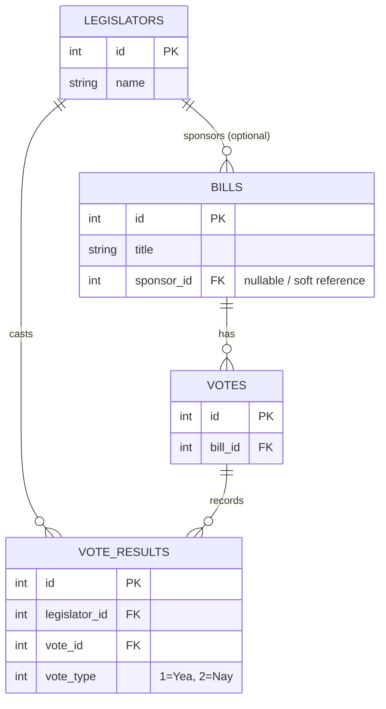
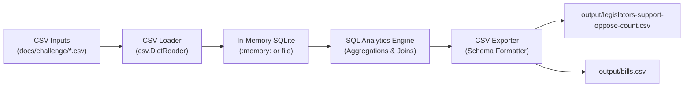

# Implementation Plan: Quorum Legislative Data Analysis

Implement a clean, robust, and extensible Python pipeline to process congressional legislative voting data, answering the two core analytical questions and producing the required CSV reports.

---

## Goal Description

At Quorum, legislative data represents legislators, bills introduced in Congress, votes on those bills, and individual vote results cast by legislators. 

The goal of this project is to build an end-to-end data processing solution that ingests four CSV datasets (`legislators.csv`, `bills.csv`, `votes.csv`, and `vote_results.csv`) and generates two specific analytical CSV deliverables:
1. **`output/legislators-support-oppose-count.csv`**: For every legislator in the dataset, count the number of bills they supported (Yea, vote type `1`) and opposed (Nay, vote type `2`).
2. **`output/bills.csv`**: For every bill in the dataset, count how many legislators supported it, how many opposed it, and report the primary sponsor's name (falling back to `"Unknown"` if missing or not present in the dataset).

---

## User Review Required

> [!IMPORTANT]
> **Production Dependencies**: The runtime implementation strictly uses the **Python Standard Library** (`sqlite3`, `csv`, `pathlib`, `argparse`, `dataclasses`, `logging`). Reviewers and users can run the pipeline immediately with standard Python without running `pip install`.
> 
> **Development Dependencies**: `pytest` is used for automated testing and is declared in `pyproject.toml` and `requirements-dev.txt`.

> [!NOTE]
> **Evidence Archiving**: This document serves as verifiable evidence of the architectural and design choices agreed upon before implementation.

---

## Open Questions

None. All architectural decisions (SQLite in-memory engine, zero-config CLI defaults, distinct vote counting semantics, `src/` layout, `pytest` testing, and write-up formatting) were resolved and confirmed during the discovery interview.

---

## Architectural Design

### Relational Entity-Relationship Diagram



### Data Pipeline Flow



---

## Proposed Changes

Grouped by component in logical order of dependency:

```
src/
├── __init__.py
├── db.py          # Database connection factory & PRAGMA configurations
├── schema.py      # DDL definitions (tables, constraints, indexes)
├── loader.py      # CSV ingestion engine using batch insertion
├── queries.py     # SQL analytical aggregations for legislators and bills
├── exporter.py    # Formatted CSV exporter adhering to exact output schemas
└── main.py        # CLI entry point (argparse) with zero-config defaults
tests/
├── __init__.py
├── conftest.py    # Pytest fixtures (in-memory DB, sample fixtures)
├── test_loader.py # Tests for ingestion, constraints, and data validation
├── test_queries.py# Tests for aggregation semantics, edge cases, and missing sponsors
└── test_e2e.py    # Regression tests validating against challenge data
docs/
└── plan.md        # Persistent copy of this plan for evidence of choices
pyproject.toml     # Packaging metadata
requirements-dev.txt # Development test tools (pytest)
README.md          # Project guide, architecture, usage, and testing
```

---

### Component 1: Packaging & Development Dependencies

#### `pyproject.toml`
Defines project metadata, Python compatibility (>=3.10), package discovery, and pytest configuration:
```toml
[build-system]
requires = ["setuptools>=61.0"]
build-backend = "setuptools.build_meta"

[project]
name = "quorum-legislative-data"
version = "0.1.0"
description = "Quorum Coding Challenge - Legislative Data Analysis"
readme = "README.md"
requires-python = ">=3.10"
dependencies = []

[project.optional-dependencies]
dev = [
    "pytest>=8.0.0",
]

[tool.pytest.ini_options]
testpaths = ["tests"]
python_files = ["test_*.py"]
```

#### `requirements-dev.txt`
Developer dependencies file for quick virtualenv setup:
```text
pytest>=8.0.0
```

---

### Component 2: Core Database & Schema Layer

#### `src/__init__.py`
Package initialization and public exports.

#### `src/db.py`
Database connection factory:
* Provides `get_connection(db_path: str = ":memory:") -> sqlite3.Connection`.
* Enforces `PRAGMA foreign_keys = ON;` and sets `row_factory = sqlite3.Row`.
* Manages context-managed connections ensuring clean closing and transaction rollback on failure.

#### `src/schema.py`
DDL schema creation:
* `legislators`: `(id INTEGER PRIMARY KEY, name TEXT NOT NULL)`
* `bills`: `(id INTEGER PRIMARY KEY, title TEXT NOT NULL, sponsor_id INTEGER)`
  * *Design note*: `sponsor_id` is a soft relationship (no strict FK constraint) because the requirements state a sponsor might not exist in `legislators.csv`, falling back to `"Unknown"`.
* `votes`: `(id INTEGER PRIMARY KEY, bill_id INTEGER NOT NULL REFERENCES bills(id))`
* `vote_results`: `(id INTEGER PRIMARY KEY, legislator_id INTEGER NOT NULL REFERENCES legislators(id), vote_id INTEGER NOT NULL REFERENCES votes(id), vote_type INTEGER NOT NULL CHECK (vote_type IN (1, 2)))`
* Indexes:
  * `CREATE INDEX IF NOT EXISTS idx_votes_bill_id ON votes(bill_id);`
  * `CREATE INDEX IF NOT EXISTS idx_vote_results_leg ON vote_results(legislator_id);`
  * `CREATE INDEX IF NOT EXISTS idx_vote_results_vote ON vote_results(vote_id);`
  * `CREATE INDEX IF NOT EXISTS idx_vote_results_type ON vote_results(vote_type);`

---

### Component 3: Ingestion & Analytical Queries Layer

#### `src/loader.py`
Ingestion service:
* Ingests CSV files using standard library `csv.DictReader`.
* Strips whitespace from header keys and cell values.
* Casts integer IDs and handles empty/blank sponsor IDs as `NULL`.
* Uses `executemany` inside a transaction for maximum insertion performance ($O(N)$ batch insert).
* Exposes `load_all_csvs(conn, input_dir: Path)` with graceful error reporting if files are missing.

#### `src/queries.py`
Analytical SQL queries matching the challenge deliverables:

1. **Legislator Support / Oppose Summary**:
```sql
SELECT 
    l.id AS id,
    l.name AS name,
    COUNT(DISTINCT CASE WHEN vr.vote_type = 1 THEN v.bill_id END) AS num_supported_bills,
    COUNT(DISTINCT CASE WHEN vr.vote_type = 2 THEN v.bill_id END) AS num_opposed_bills
FROM legislators l
LEFT JOIN vote_results vr ON l.id = vr.legislator_id
LEFT JOIN votes v ON vr.vote_id = v.id
GROUP BY l.id, l.name
ORDER BY l.id ASC;
```
*Key features*:
* `LEFT JOIN` ensures legislators with 0 votes cast (such as `Rep. John Yarmuth`) are preserved with `0` supported and `0` opposed.
* `COUNT(DISTINCT v.bill_id)` prevents double-counting if a bill undergoes multiple votes.

2. **Bill Support / Oppose Summary**:
```sql
SELECT 
    b.id AS id,
    b.title AS title,
    COUNT(DISTINCT CASE WHEN vr.vote_type = 1 THEN vr.legislator_id END) AS supporter_count,
    COUNT(DISTINCT CASE WHEN vr.vote_type = 2 THEN vr.legislator_id END) AS opposer_count,
    COALESCE(l.name, 'Unknown') AS primary_sponsor
FROM bills b
LEFT JOIN legislators l ON b.sponsor_id = l.id
LEFT JOIN votes v ON b.id = v.bill_id
LEFT JOIN vote_results vr ON v.id = vr.vote_id
GROUP BY b.id, b.title, l.name
ORDER BY b.id ASC;
```
*Key features*:
* `COALESCE(l.name, 'Unknown')` cleanly satisfies the requirement to output `"Unknown"` when sponsor ID is missing or unlisted.
* `LEFT JOIN` ensures bills with 0 votes report `0` supporters and `0` opposers.

---

### Component 4: CSV Export & CLI Application

#### `src/exporter.py`
* Exports query results to CSV using `csv.DictWriter`.
* Ensures exact required column ordering and headers:
  * `id,name,num_supported_bills,num_opposed_bills`
  * `id,title,supporter_count,opposer_count,primary_sponsor`
* Automatically creates output directories if they do not exist.

#### `src/main.py`
CLI entrypoint:
* Standard library `argparse` CLI:
  * `--input-dir` (default: `docs/challenge`)
  * `--output-dir` (default: `output`)
  * `--db-path` (default: `:memory:`, allows `--db-path legislative.db`)
  * `--log-level` (default: `INFO`)
* Orchestrates: Connect -> Initialize Schema -> Ingest CSVs -> Execute Queries -> Export CSVs -> Print summary.

---

### Component 5: Test Suite

#### `tests/__init__.py`

#### `tests/conftest.py`
* Pytest fixture `db_conn`: creates an in-memory SQLite database with schema initialized.
* Pytest fixture `sample_data_dir`: points to `docs/challenge`.

#### `tests/test_loader.py`
* Tests successful CSV loading.
* Tests handling of missing or corrupted files.
* Tests constraint validation (e.g. invalid `vote_type` rejected).

#### `tests/test_queries.py`
* Tests legislators with 0 votes cast -> reports `0` supported, `0` opposed.
* Tests bills with 0 votes cast -> reports `0` supporters, `0` opposers.
* Tests bills with unmapped sponsor -> outputs `"Unknown"`.
* Tests multi-vote bills -> verifies `COUNT(DISTINCT ...)` prevents double-counting.

#### `tests/test_e2e.py`
* Runs full pipeline on the challenge dataset `docs/challenge/`.
* Verifies generated `output/legislators-support-oppose-count.csv`:
  * Contains 20 rows + header.
  * Verified legislator counts (e.g., Rep. John Yarmuth has 0 supported, 0 opposed).
* Verifies generated `output/bills.csv`:
  * Contains 2 rows + header.
  * Bill 2952375 (Build Back Better): 6 supporters, 13 opposers, Sponsor: "Rep. John Yarmuth (D-KY-3)".
  * Bill 2900994 (Infrastructure Act): 13 supporters, 6 opposers, Sponsor: "Unknown".

---

### Component 6: Documentation & Evidence

#### `README.md`
Update README with:
* System architecture and ER diagram.
* Quickstart instructions (single zero-argument command `python -m src.main`).
* CLI options reference.
* Running test suite instructions (`pytest` or `python -m unittest`).
* Verification evidence and output samples.

#### `docs/plan.md`
Committed copy of this approved implementation plan for persistent evidence in the repository.

---

## Verification Plan

### Automated Tests
Run the complete automated test suite using `pytest`:
```powershell
python -m pytest -v
```
Also verify fallback execution with Python's standard library `unittest` (requiring 0 installed packages):
```powershell
python -m unittest discover -s tests -p "test_*.py" -v
```

### Manual Verification
1. **Run Pipeline with Default Zero-Config**:
   ```powershell
   python -m src.main
   ```
2. **Verify Output Files Generated**:
   * Inspect `output/legislators-support-oppose-count.csv`:
     * Verify headers: `id,name,num_supported_bills,num_opposed_bills`
     * Verify 20 legislator rows.
     * Confirm `412211,Rep. John Yarmuth (D-KY-3),0,0`.
   * Inspect `output/bills.csv`:
     * Verify headers: `id,title,supporter_count,opposer_count,primary_sponsor`
     * Verify 2 bill rows:
       * `2952375,H.R. 5376: Build Back Better Act,6,13,Rep. John Yarmuth (D-KY-3)`
       * `2900994,H.R. 3684: Infrastructure Investment and Jobs Act,13,6,Unknown`
3. **Verify Database Persistence Option**:
   ```powershell
   python -m src.main --db-path legislative.db
   ```
   Confirm `legislative.db` is created and can be queried.
